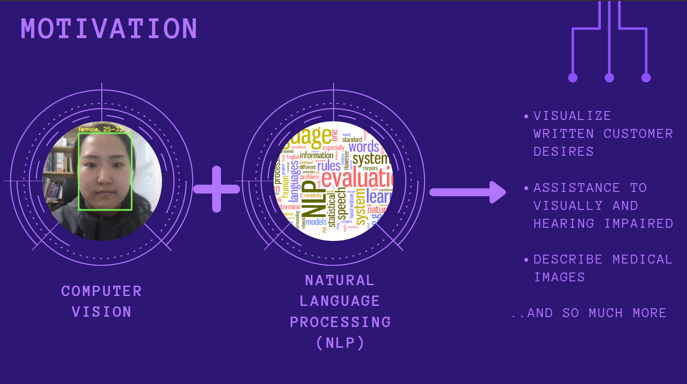
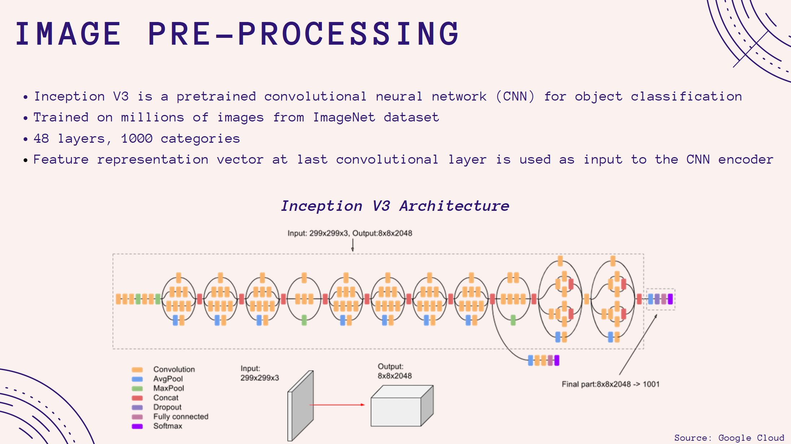
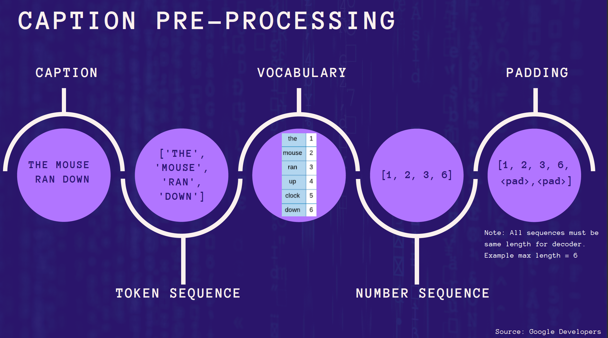
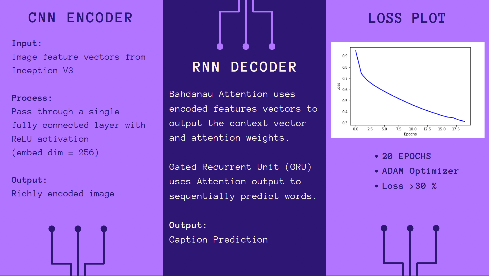
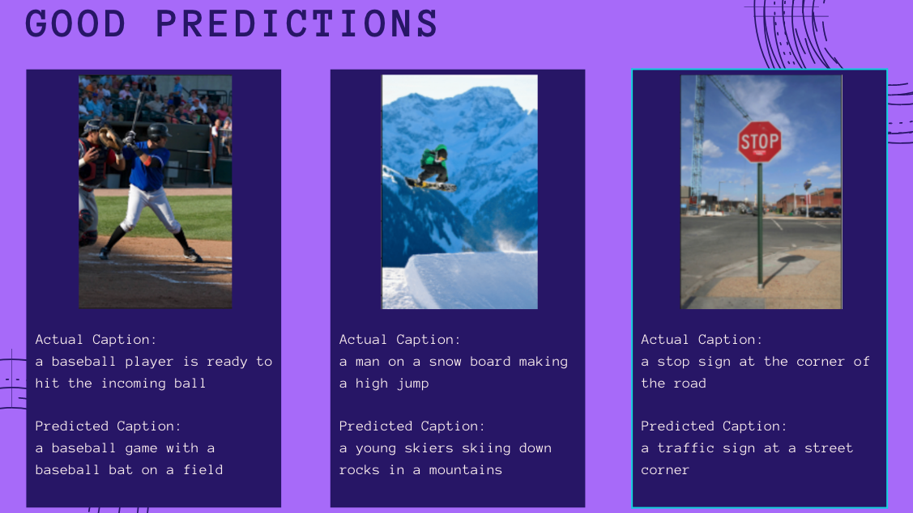
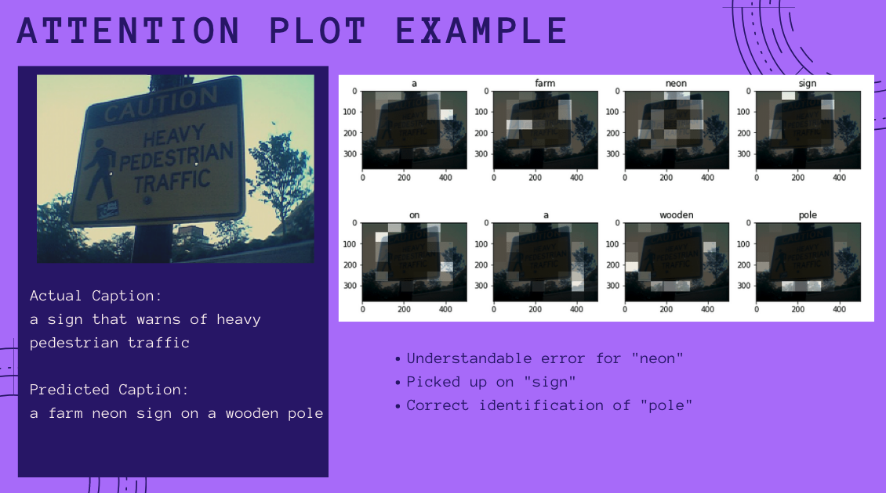
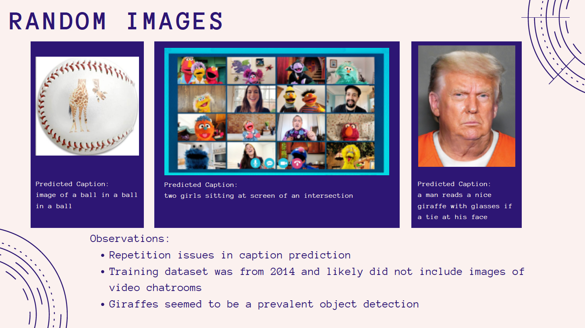

# Image-Captioning

## Overview
The goal of this project was to combine neural networks to generate image captions using both computer vision natural language tools. 
My inspiration to learn more about this topic was the Microsoft SeeingAI app and [Fei Fei Li's 2015 Ted Talk](https://www.ted.com/talks/fei_fei_li_how_we_re_teaching_computers_to_understand_pictures) about teaching computers to understand pictures. 
The code for this project is mainly adapted from a TensorFlow tutorial.

## Data and Tools
  Data: 50,000 images and captions from the [MS COCO dataset 2014](https://cocodataset.org/#download)
  Tools: TensorFlow and Python
  
## Data Preparation
Using transfer learning with Inception V3 to extract the features from the images, the final convolutional layer is the input for the encoder model.  

  
Computers prefer numbers over strings, so each caption was first tokenized and then converted to a number sequence.  Because the decoder RNN requires the captions to be the same length, each number sequence received pad tokens as necessary.  

  
## The Model
I used a series of models to "translate" the images into word captions.  The encoder used a convolutional neural network (CNN) and the decoder model used a Gated Recurrent Unit Neural Network with a Bahdanau Attention.  Running my model with 20 epochs and an Adam Optimizer, the final loss was about 30%. 

 
## Examples
  - Good Captions:  The examples below show the predicted captions aren't as descriptive as the actual captions, but still pretty good!

  
  - Attention Plot Example: Although the predicted caption was not the best, looking at the attention plot gives insight to why the model chose certain words.  For example, looking at the attention image under "neon" you can see the attention light up on the yellow parts of the sign. 

  
  - Bad Captions: While viewing predicted captions on the validation images, I noticed errors with repeated words as well as a bias to classify objects as "balls" or "giraffes."

## Conclusion
Future work to improve this model could include different NLP tools such as BERT and Transformers and of course running more epochs.

      

